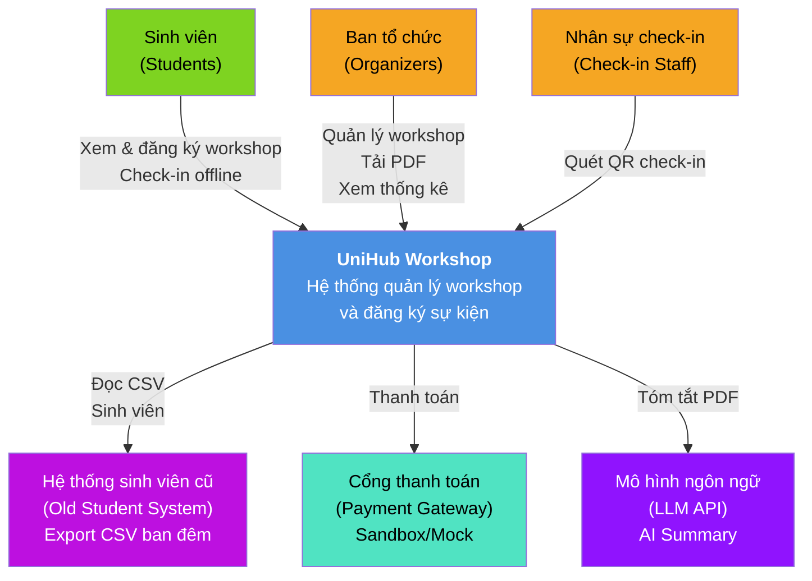
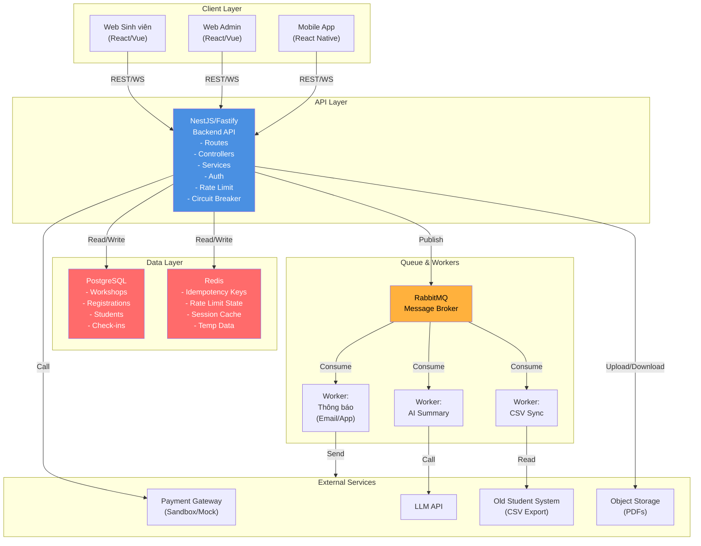
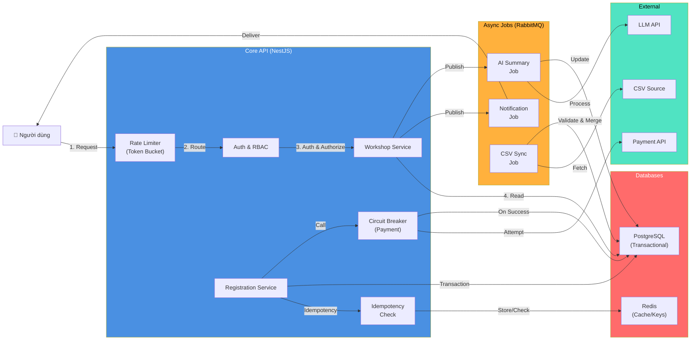
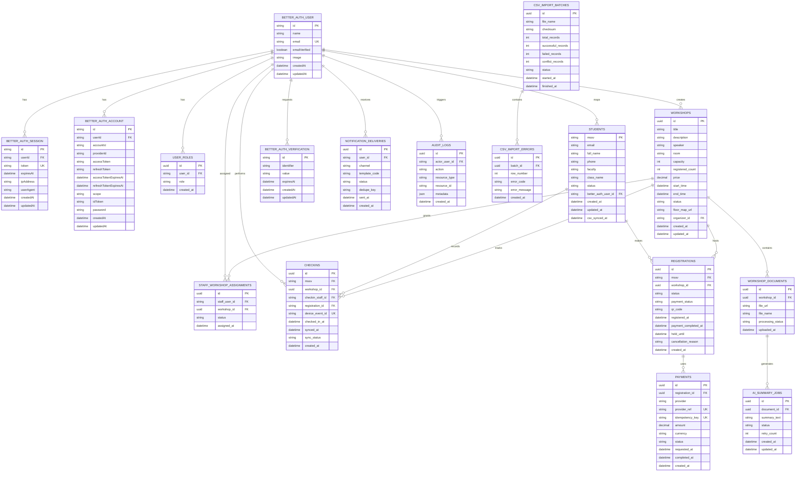

# UniHub Workshop — Technical Design

## Kiến trúc tổng thể

### Architectural Style: Modular Monolith + Worker Pattern

UniHub Workshop được thiết kế theo mô hình **modular monolith kết hợp background workers**, thay vì microservices. Lựa chọn này vì:

- **Đơn giản triển khai**: Một codebase dễ quản lý cho đồ án học tập, tránh độ phức tạp của service-to-service communication, health checks, và distributed transactions.
- **Tính nhất quán dữ liệu mạnh**: Luồng đăng ký quan trọng chạy trong cùng process, kiểm soát transaction chặt chẽ, giảm race condition.
- **Dễ debug**: Stack trace, logging, distributed tracing ít phức tạp hơn microservices.
- **Khả năng mở rộng đủ**: RabbitMQ cho các tác vụ bất đồng bộ, Redis cho cache/rate limiting, cho phép scale workers riêng nếu cần.

### Các thành phần chính

1. **Backend API (NestJS + Fastify)**: Xử lý tất cả endpoint, logic nghiệp vụ, RBAC, rate limiting, circuit breaker.
2. **Transactional Database (PostgreSQL)**: Source of truth cho dữ liệu workshop, đăng ký, sinh viên, check-in.
3. **Cache & Session Store (Redis)**: Lưu idempotency keys, rate limit state, session/JWT validation, dữ liệu tạm thời.
4. **Message Broker (RabbitMQ)**: Hàng đợi bất đồng bộ cho thông báo, AI Summary, CSV sync.
5. **Background Workers (NestJS Standalone Consumers)**: Xử lý từng loại job được publish qua RabbitMQ.
6. **Object Storage**: Lưu PDF tải lên, artifacts được tạo từ AI.
7. **Authentication (BetterAuth)**: Hybrid: session cho admin web, JWT cho mobile/API.
8. **External Integrations**:
   - Payment Gateway (sandbox/mock)
   - LLM API (AI Summary)
   - Student Management System (CSV batch import)

---

## C4 Diagram

### Level 1 — System Context



### Level 2 — Container



---

## High-Level Architecture Diagram



---

## Thiết kế cơ sở dữ liệu

### Loại Database và Lý do

**PostgreSQL (Primary / Source of Truth)**: Lưu toàn bộ dữ liệu nghiệp vụ và dữ liệu giao dịch:

- Hỗ trợ ACID transaction đầy đủ, cần thiết cho tranh chấp chỗ ngồi, giữ chỗ tạm và xác nhận đăng ký.
- Hỗ trợ unique constraint, foreign key, partial index và advisory lock để xử lý race condition rõ ràng.
- Phù hợp với mô hình modular monolith, nơi phần lớn business logic chạy tập trung và cần nhất quán mạnh.

**Redis (Secondary / Ephemeral State)**: Lưu trạng thái tạm thời và tối ưu hiệu năng:

- `Idempotency keys` với TTL 24 giờ.
- `Rate limit state` cho token bucket.
- Cache ngắn hạn cho dữ liệu đọc nhiều.
- Session/token related cache của BetterAuth nếu được bật.
- Metadata tạm cho deduplication hoặc sync control.

Lưu ý:

- **Dữ liệu check-in offline gốc nằm trên thiết bị mobile**, không nằm trong Redis. Server chỉ tiếp nhận và đối soát khi thiết bị đồng bộ lại.
- **File PDF và artifact AI không lưu trực tiếp trong PostgreSQL**; database chỉ lưu metadata, còn nội dung file nằm trong Object Storage.

### Entity Relationship Diagram



### SQL Schema (Các Entity quan trọng)

**Ghi chú**:

- Bảng BetterAuth (`better_auth_user`, `better_auth_session`, `better_auth_account`, `better_auth_verification`) được sinh từ BetterAuth CLI (`migrate` hoặc công cụ tương đương), không tự viết tay trong codebase nếu thư viện đã hỗ trợ.
- Dưới đây là schema cốt lõi phía ứng dụng; agent có thể điều chỉnh naming convention khi implement thực tế nhưng phải giữ nguyên ràng buộc nghiệp vụ.

```sql
-- BetterAuth core tables do BetterAuth tạo ra.
-- Phần dưới là application schema bổ sung.

CREATE TABLE user_roles (
  id UUID PRIMARY KEY DEFAULT gen_random_uuid(),
  user_id VARCHAR(191) NOT NULL REFERENCES better_auth_user(id) ON DELETE CASCADE,
  role VARCHAR(50) NOT NULL CHECK (role IN ('student', 'organizer', 'checkin_staff')),
  created_at TIMESTAMP DEFAULT CURRENT_TIMESTAMP,
  UNIQUE(user_id, role)
);

-- Hồ sơ sinh viên đồng bộ từ CSV và ánh xạ sang danh tính BetterAuth khi user kích hoạt tài khoản.
CREATE TABLE students (
  mssv VARCHAR(20) PRIMARY KEY,
  email VARCHAR(255) UNIQUE,
  full_name VARCHAR(255) NOT NULL,
  phone VARCHAR(20),
  faculty VARCHAR(255),
  class_name VARCHAR(100),
  status VARCHAR(50) DEFAULT 'active',
  better_auth_user_id VARCHAR(191) REFERENCES better_auth_user(id) ON DELETE SET NULL,
  created_at TIMESTAMP DEFAULT CURRENT_TIMESTAMP,
  updated_at TIMESTAMP DEFAULT CURRENT_TIMESTAMP,
  csv_synced_at TIMESTAMP
);

CREATE TABLE workshops (
  id UUID PRIMARY KEY DEFAULT gen_random_uuid(),
  title VARCHAR(255) NOT NULL,
  description TEXT,
  speaker VARCHAR(255),
  room VARCHAR(100),
  capacity INT NOT NULL,
  registered_count INT DEFAULT 0,
  price DECIMAL(10, 2) DEFAULT 0,
  start_time TIMESTAMP NOT NULL,
  end_time TIMESTAMP NOT NULL,
  status VARCHAR(50) DEFAULT 'draft',
  floor_map_url VARCHAR(2048),
  organizer_id VARCHAR(191) NOT NULL REFERENCES better_auth_user(id),
  created_at TIMESTAMP DEFAULT CURRENT_TIMESTAMP,
  updated_at TIMESTAMP DEFAULT CURRENT_TIMESTAMP,
  CONSTRAINT valid_time CHECK (end_time > start_time),
  CONSTRAINT valid_capacity CHECK (capacity > 0),
  CONSTRAINT valid_price CHECK (price >= 0)
);

CREATE TABLE registrations (
  id UUID PRIMARY KEY DEFAULT gen_random_uuid(),
  mssv VARCHAR(20) NOT NULL REFERENCES students(mssv),
  workshop_id UUID NOT NULL REFERENCES workshops(id),
  status VARCHAR(50) DEFAULT 'registered'
    CHECK (status IN ('pending_payment', 'registered', 'cancelled', 'expired', 'checked_in')),
  payment_status VARCHAR(50) DEFAULT 'pending',
  qr_code VARCHAR(255) UNIQUE NOT NULL,
  registered_at TIMESTAMP DEFAULT CURRENT_TIMESTAMP,
  payment_completed_at TIMESTAMP,
  held_until TIMESTAMP,
  cancellation_reason VARCHAR(255),
  created_at TIMESTAMP DEFAULT CURRENT_TIMESTAMP,
  UNIQUE(mssv, workshop_id)
);

CREATE INDEX idx_registrations_mssv ON registrations(mssv);
CREATE INDEX idx_registrations_workshop_id ON registrations(workshop_id);
CREATE INDEX idx_registrations_status ON registrations(status);
CREATE INDEX idx_registrations_held_until ON registrations(held_until);

CREATE TABLE payments (
  id UUID PRIMARY KEY DEFAULT gen_random_uuid(),
  registration_id UUID NOT NULL REFERENCES registrations(id) ON DELETE CASCADE,
  provider VARCHAR(50) NOT NULL,
  provider_ref VARCHAR(191) UNIQUE,
  idempotency_key VARCHAR(191) UNIQUE NOT NULL,
  amount DECIMAL(10, 2) NOT NULL CHECK (amount >= 0),
  currency VARCHAR(10) NOT NULL DEFAULT 'VND',
  status VARCHAR(50) NOT NULL
    CHECK (status IN ('pending', 'processing', 'success', 'failed', 'cancelled', 'expired')),
  requested_at TIMESTAMP DEFAULT CURRENT_TIMESTAMP,
  completed_at TIMESTAMP,
  created_at TIMESTAMP DEFAULT CURRENT_TIMESTAMP
);

CREATE INDEX idx_payments_registration_id ON payments(registration_id);
CREATE INDEX idx_payments_status ON payments(status);

CREATE TABLE checkins (
  id UUID PRIMARY KEY DEFAULT gen_random_uuid(),
  mssv VARCHAR(20) NOT NULL REFERENCES students(mssv),
  workshop_id UUID NOT NULL REFERENCES workshops(id),
  registration_id UUID NOT NULL REFERENCES registrations(id),
  checkin_staff_id VARCHAR(191) NOT NULL REFERENCES better_auth_user(id),
  device_event_id VARCHAR(191) UNIQUE,
  checked_in_at TIMESTAMP NOT NULL,
  synced_at TIMESTAMP,
  sync_status VARCHAR(50) DEFAULT 'pending'
    CHECK (sync_status IN ('pending', 'synced', 'rejected', 'conflict')),
  created_at TIMESTAMP DEFAULT CURRENT_TIMESTAMP,
  UNIQUE(registration_id)
);

CREATE INDEX idx_checkins_mssv ON checkins(mssv);
CREATE INDEX idx_checkins_workshop_id ON checkins(workshop_id);
CREATE INDEX idx_checkins_sync_status ON checkins(sync_status);

CREATE TABLE staff_workshop_assignments (
  id UUID PRIMARY KEY DEFAULT gen_random_uuid(),
  staff_user_id VARCHAR(191) NOT NULL REFERENCES better_auth_user(id) ON DELETE CASCADE,
  workshop_id UUID NOT NULL REFERENCES workshops(id) ON DELETE CASCADE,
  status VARCHAR(50) NOT NULL DEFAULT 'active' CHECK (status IN ('active', 'revoked')),
  assigned_at TIMESTAMP DEFAULT CURRENT_TIMESTAMP,
  UNIQUE(staff_user_id, workshop_id)
);

CREATE TABLE workshop_documents (
  id UUID PRIMARY KEY DEFAULT gen_random_uuid(),
  workshop_id UUID NOT NULL REFERENCES workshops(id),
  file_url VARCHAR(2048) NOT NULL,
  file_name VARCHAR(255),
  processing_status VARCHAR(50) DEFAULT 'uploaded'
    CHECK (processing_status IN ('uploaded', 'processing', 'completed', 'failed')),
  uploaded_at TIMESTAMP DEFAULT CURRENT_TIMESTAMP
);

CREATE TABLE ai_summary_jobs (
  id UUID PRIMARY KEY DEFAULT gen_random_uuid(),
  document_id UUID NOT NULL REFERENCES workshop_documents(id) ON DELETE CASCADE,
  summary_text TEXT,
  status VARCHAR(50) DEFAULT 'processing'
    CHECK (status IN ('processing', 'completed', 'failed')),
  retry_count INT DEFAULT 0,
  created_at TIMESTAMP DEFAULT CURRENT_TIMESTAMP,
  updated_at TIMESTAMP DEFAULT CURRENT_TIMESTAMP
);

CREATE TABLE notification_deliveries (
  id UUID PRIMARY KEY DEFAULT gen_random_uuid(),
  user_id VARCHAR(191) NOT NULL REFERENCES better_auth_user(id) ON DELETE CASCADE,
  channel VARCHAR(50) NOT NULL CHECK (channel IN ('email', 'in_app')),
  template_code VARCHAR(100) NOT NULL,
  status VARCHAR(50) NOT NULL
    CHECK (status IN ('pending', 'queued', 'sent', 'failed')),
  dedupe_key VARCHAR(191),
  sent_at TIMESTAMP,
  created_at TIMESTAMP DEFAULT CURRENT_TIMESTAMP
);

CREATE INDEX idx_notification_deliveries_user_id ON notification_deliveries(user_id);
CREATE INDEX idx_notification_deliveries_status ON notification_deliveries(status);
CREATE UNIQUE INDEX idx_notification_deliveries_dedupe_key
  ON notification_deliveries(dedupe_key)
  WHERE dedupe_key IS NOT NULL;

CREATE TABLE audit_logs (
  id UUID PRIMARY KEY DEFAULT gen_random_uuid(),
  actor_user_id VARCHAR(191) REFERENCES better_auth_user(id) ON DELETE SET NULL,
  action VARCHAR(100) NOT NULL,
  resource_type VARCHAR(100) NOT NULL,
  resource_id VARCHAR(191),
  metadata JSONB,
  created_at TIMESTAMP DEFAULT CURRENT_TIMESTAMP
);

CREATE INDEX idx_audit_logs_actor_user_id ON audit_logs(actor_user_id);
CREATE INDEX idx_audit_logs_resource ON audit_logs(resource_type, resource_id);
CREATE INDEX idx_audit_logs_created_at ON audit_logs(created_at);

CREATE TABLE csv_import_batches (
  id UUID PRIMARY KEY DEFAULT gen_random_uuid(),
  file_name VARCHAR(255) NOT NULL,
  checksum VARCHAR(191),
  total_records INT DEFAULT 0,
  successful_records INT DEFAULT 0,
  failed_records INT DEFAULT 0,
  conflict_records INT DEFAULT 0,
  status VARCHAR(50) NOT NULL
    CHECK (status IN ('pending', 'running', 'completed', 'completed_with_errors', 'failed')),
  started_at TIMESTAMP DEFAULT CURRENT_TIMESTAMP,
  finished_at TIMESTAMP,
  error_message TEXT
);

CREATE TABLE csv_import_errors (
  id UUID PRIMARY KEY DEFAULT gen_random_uuid(),
  batch_id UUID NOT NULL REFERENCES csv_import_batches(id) ON DELETE CASCADE,
  row_number INT,
  error_code VARCHAR(100),
  error_message TEXT NOT NULL,
  created_at TIMESTAMP DEFAULT CURRENT_TIMESTAMP
);
```

### Ràng buộc và quyết định dữ liệu quan trọng

- `registrations (mssv, workshop_id)` là unique để chặn đăng ký trùng.
- Workshop có phí dùng `held_until` để giữ chỗ tạm 10 phút; job nền sẽ hủy giữ chỗ khi quá hạn.
- `payments` tách riêng khỏi `registrations` để giữ lịch sử retry, webhook callback và idempotency rõ ràng.
- `checkins.registration_id` là unique để đảm bảo một đăng ký chỉ có một check-in hợp lệ cuối cùng.
- `checkins.device_event_id` dùng để deduplicate khi thiết bị mobile đồng bộ lại sau thời gian offline.
- `staff_workshop_assignments` là nguồn sự thật cho phạm vi check-in của nhân sự; không hard-code workshop ở client.
- `workshop_documents` chỉ lưu metadata file; file thật nằm ở Object Storage.
- `notification_deliveries` lưu trạng thái gửi thông báo qua email/in-app và hỗ trợ dedupe khi worker retry.
- `audit_logs` lưu vết các thao tác nhạy cảm như tạo/sửa/hủy workshop, phân công staff và đồng bộ check-in.
- `csv_import_batches` và `csv_import_errors` tồn tại để hỗ trợ audit, báo cáo theo lô và truy vết lỗi nhập CSV.
- **SOLID principle**: Schema tách rõ domain tables (workshops, registrations, checkins) khỏi auth tables (better*auth*\*) để tránh coupling giữa authentication và business logic.

### Luồng dữ liệu quan trọng ở tầng database

#### Đăng ký workshop có phí

- Bước kiểm tra còn chỗ, tạo registration, ghi payment pending và set `held_until` phải chạy trong transaction.
- Có thể dùng `SELECT ... FOR UPDATE` hoặc `UPDATE ... WHERE registered_count < capacity` để chốt tranh chấp chỗ ngồi.
- Chỉ khi `payments.status = success` thì `registrations.status` mới chuyển sang `registered`.

#### Check-in offline

- Dữ liệu gốc lưu cục bộ trên mobile.
- Khi sync, backend đối chiếu `device_event_id`, `registration_id`, `staff_workshop_assignments` và trạng thái đăng ký hiện tại.
- Nếu trùng hoặc không còn hợp lệ, bản ghi bị đánh dấu `rejected` hoặc `conflict`.

#### CSV Sync theo lô

- Worker đọc file CSV, ghi một dòng trong `csv_import_batches`, sau đó validate từng record.
- Dòng lỗi được lưu tại `csv_import_errors`, không làm sập cả lô.
- Chính sách xung đột là `last-write-wins` cho dữ liệu sinh viên đến từ CSV.

---

## Thiết kế kiểm soát truy cập

### Mô hình RBAC (Role-Based Access Control)

Hệ thống có **3 roles chính**:

#### 1. **Student (Sinh viên)**

- Quyền:
  - Xem danh sách workshop (public, paginated)
  - Xem chi tiết workshop (bao gồm mô tả, AI Summary nếu có)
  - Đăng ký workshop (miễn phí hoặc thanh toán)
  - Xem lịch sử đăng ký của mình
  - Xem mã QR của đăng ký
- Endpoint API:
  - `GET /workshops` - danh sách
  - `GET /workshops/{id}` - chi tiết
  - `POST /registrations` - đăng ký
  - `GET /registrations/me` - lịch sử của tôi
  - `GET /registrations/{id}/qr` - QR code
- Authentication: JWT hoặc session

#### 2. **Organizer (Ban tổ chức)**

- Quyền:
  - Tạo workshop mới
  - Sửa workshop (title, description, speaker, room, time, capacity, price)
  - Hủy workshop
  - Xem danh sách sinh viên đã đăng ký
  - Xem thống kê (tổng đăng ký, số check-in, doanh thu)
  - Tải lên PDF workshop
  - Xem AI Summary của workshop
- Endpoint API:
  - `POST /admin/workshops` - tạo
  - `PATCH /admin/workshops/{id}` - sửa
  - `DELETE /admin/workshops/{id}` - hủy
  - `GET /admin/workshops/{id}/registrations` - danh sách đăng ký
  - `GET /admin/statistics` - thống kê
  - `POST /admin/workshops/{id}/pdf` - tải PDF
  - `GET /admin/workshops/{id}/summary` - xem AI summary
- Authentication: Session (admin web) hoặc JWT (API)

#### 3. **CheckinStaff (Nhân sự check-in)**

- Quyền:
  - Quét QR code sinh viên
  - Xác nhận check-in
  - Xem danh sách check-in của workshop (chỉ workshop tương ứng)
  - Check-in offline (local storage, sync khi có mạng)
- Endpoint API:
  - `POST /checkins/scan` - quét QR
  - `POST /checkins/confirm` - xác nhận check-in
  - `GET /checkins/workshop/{id}` - danh sách check-in
  - `POST /checkins/sync` - đồng bộ offline
- Authentication: JWT hoặc session (mobile app)

### Cơ chế kiểm tra quyền

**Middleware Authorization**:

1. Middleware kiểm tra JWT/Session → extract role
2. Middleware kiểm tra endpoint yêu cầu quyền nào
3. So sánh role user với required role
4. Nếu hợp lệ → `next()`, nếu không → 403 Forbidden

---

## Thiết kế các cơ chế bảo vệ hệ thống

### Kiểm soát tải đột biến

**Vấn đề**: 12.000 sinh viên trong 10 phút đầu, 60% trong 3 phút đầu → request rate có thể vượt quá khả năng xử lý.

**Giải pháp: Token Bucket Algorithm**

**Cấu hình cho UniHub Workshop**:

| Endpoint                   | Ngưỡng                     | Refill                | Thời gian cửa sổ         |
| -------------------------- | -------------------------- | --------------------- | ------------------------ |
| `GET /workshops` (public)  | 100 requests/phút          | 100/60s               | Per user IP              |
| `POST /registrations`      | 10 requests/phút           | 10/60s                | Per user (authenticated) |
| `GET /admin/*`             | 50 requests/phút           | 50/60s                | Per user (admin)         |
| `POST /checkins` (offline) | 1000 requests/phút (local) | Unlimited khi offline | Local device             |

**Fallback khi rate limit vượt quá**:

- Sinh viên nhận thông báo "Hệ thống quá tải, vui lòng thử lại sau 60 giây".
- API trả về 429 status code với header `Retry-After: 60`.

### Xử lý cổng thanh toán không ổn định

**Vấn đề**: Payment gateway có thể timeout hoặc lỗi → dẫn tới cascading failure.

**Giải pháp: Circuit Breaker + Graceful Degradation**

**Circuit Breaker có 3 trạng thái**:

1. **Closed** (bình thường): Gọi payment gateway bình thường.
2. **Open** (ngắt): Sau N lỗi liên tiếp (N=5) → chuyển sang Open, không gọi gateway.
3. **Half-Open** (thử kết nối): Sau 60 giây → thử 1 request test.

**Cấu hình**:

```
Failure Threshold: 5 lỗi liên tiếp hoặc 50% error rate
Timeout: 5 giây per request
Open Duration: 60 giây
```

**Graceful Degradation**:

- **Workshop miễn phí**: vẫn cho đăng ký bình thường.
- **Workshop có phí**: báo lỗi nhưng xem danh sách workshop vẫn hoạt động.

### Chống trừ tiền hai lần

**Vấn đề**: Client retry payment request → thanh toán 2 lần.

**Giải pháp: Idempotency Key + Deduplication**

**Cấu hình**:

| Tham số             | Giá trị             | Ghi chú                |
| ------------------- | ------------------- | ---------------------- |
| TTL Idempotency Key | 24 giờ              | Đủ cho retry window    |
| Storage             | Redis               | Nhanh, in-memory       |
| Key Format          | `idempotency:{key}` | Dễ query debug         |
| Collision Detection | UUID v4             | Xác suất collision ≈ 0 |

**Luồng xử lý**:

```
1. Client gửi Idempotency-Key header
2. Server kiểm tra Redis:
   - Nếu tìm thấy (đã xử lý) → trả response cũ
   - Nếu không (lần đầu) → xử lý + lưu kết quả
3. TTL 24h → tự expire
```

#### Bổ sung cho luồng thanh toán có phí: Hold Seat 10 phút

**Ràng buộc**: Nếu đăng ký có phí chưa thanh toán → giữ chỗ trong 10 phút.  
Sau 10 phút nếu chưa thanh toán → chỗ trở thành available.

**Triển khai**:

- Khi đăng ký có phí → set `registration.held_until = NOW + 10 minutes`.
- Database query: chỉ count `registered_count` những registration hoàn tất thanh toán hoặc đang giữ chỗ (held_until > NOW).
- Background job mỗi 5 phút: tìm registration hết hạn giữ chỗ → cập nhật thành cancelled.

---

## Các quyết định kỹ thuật quan trọng (ADR)

### ADR-1: Backend Framework — NestJS + Fastify

**Lựa chọn**: NestJS (TypeScript) chạy trên Fastify engine.

**Các phương án khác**:

1. **Express + Node.js thuần**: Đơn giản, nhưng thiếu cấu trúc → khó bảo trì, không có kiểu dữ liệu.
2. **Spring Boot (Java)**: Mạnh và trưởng thành, nhưng nặng, khởi động chậm.

**Đánh đổi của từng phương án**:

- Express: Dễ học, linh hoạt | nhưng thiếu cấu trúc, không có kiểu dữ liệu
- Spring Boot: Mature, doanh nghiệp | nhưng nặng, khởi động chậm, học tập khó
- **NestJS + Fastify**: Cấu trúc rõ ràng, kiểu dữ liệu, HTTP nhanh | nhưng thiết lập phức tạp hơn Express

**Tại sao chọn NestJS + Fastify**: Cân bằng giữa trải nghiệm lập trình viên (cấu trúc + kiểu dữ liệu) và hiệu suất (Fastify nhanh, xử lý tải cao).

---

### ADR-2: Database — PostgreSQL + Redis

**Lựa chọn**: PostgreSQL làm primary, Redis cho cache/session/rate limiting.

**Các phương án khác**:

1. **MySQL + Redis**: Tương tự PostgreSQL, hỗ trợ ACID, nhưng PostgreSQL mạnh hơn về tính năng nâng cao.
2. **MongoDB + Redis**: NoSQL, mở rộng ngang dễ, nhưng mất giao dịch ACID → rủi ro dữ liệu không nhất quán.
3. **DynamoDB/Firebase**: Serverless, tự động mở rộng, nhưng bị khóa nhà cung cấp, chi phí cao, không phù hợp cho 12k người dùng.
4. **PostgreSQL đơn thuần (không Redis)**: Đơn giản, nhưng chậm hơn, không tối ưu cho cache/session.

**Đánh đổi của từng phương án**:

- MySQL: Tương tự PG | ghi phân tán khó hơn PG
- MongoDB: Mở rộng tự động | mất giao dịch, điều kiện chạy khó lớn
- DynamoDB: Serverless | bị khóa, chi phí, độ phức tạp
- PG đơn thuần: Đơn giản | chậm, không tối ưu
- **PG + Redis**: Nhất quán ACID, cache nhanh, giới hạn tốc độ | hơi phức tạp hơn

**Tại sao chọn PG + Redis**: ACID đảm bảo không bán quá chỗ, Redis giải quyết hiệu suất và giới hạn tốc độ.

---

### ADR-3: Message Broker — RabbitMQ

**Lựa chọn**: RabbitMQ cho hàng đợi bất đồng bộ (thông báo, tóm tắt AI, đồng bộ CSV).

**Các phương án khác**:

1. **Kafka**: Dựa trên log, thông lượng cao, nhưng thiết lập phức tạp & bảo trì, quá mức cho workshop.
2. **AWS SQS**: Quản lý hoàn toàn, nhưng bị khóa nhà cung cấp, độ trễ cao.
3. **Redis Queue (Bull/BullMQ)**: Đơn giản, trong bộ nhớ, nhưng rủi ro mất dữ liệu nếu Redis sập.
4. **BullMQ + PostgreSQL**: Bền, đơn giản, nhưng thông lượng thấp hơn.

**Đánh đổi của từng phương án**:

- Kafka: Thông lượng cao | phức tạp, overhead
- SQS: Quản lý | bị khóa, độ trễ, chi phí
- Redis Queue: Đơn giản | rủi ro mất dữ liệu, thông lượng
- BullMQ: Bền, đơn giản | thông lượng
- **RabbitMQ**: Đơn giản, đáng tin cậy, linh hoạt, phù hợp quy mô workshop | cần một ít quản lý

**Tại sao chọn RabbitMQ**: Tránh quá phức tạp (Kafka), bền (vs Redis Queue), giá rẻ (vs SQS).

---

### ADR-4: Authentication — BetterAuth (Hybrid)

**Lựa chọn**: BetterAuth với chiến lược hybrid (cookie session cho web admin, JWT cho mobile/API).

**Các phương án khác**:

1. **Auth0**: Quản lý hoàn toàn, nhưng đắt, bị khóa nhà cung cấp.
2. **Clerk**: Hiện đại, thân thiện lập trình viên, nhưng $$$, bị khóa.
3. **NextAuth.js**: Tốt cho Next.js, nhưng linh hoạt hạn chế.
4. **Chỉ JWT không trạng thái**: Đơn giản, nhưng vô hiệu hóa session khó.
5. **Chỉ session có trạng thái**: Bảo vệ XSS dễ, nhưng không phù hợp mobile/API.

**Đánh đổi của từng phương án**:

- Auth0/Clerk: Quản lý | đắt, bị khóa
- NextAuth.js: Tốt cho Next.js | cứng nhắc
- Chỉ JWT: Đơn giản | vô hiệu hóa khó
- Chỉ session: Bảo vệ XSS | không phù hợp API
- **BetterAuth Hybrid**: Tốt nhất (session + JWT), tự lưu trữ, linh hoạt | duy trì 2 quy trình

**Tại sao chọn BetterAuth**: Hybrid cho phép admin (session, bảo vệ XSS) + mobile/API (không trạng thái, mở rộng), tự lưu trữ (không bị khóa), mã mở.

---

### ADR-5: Rate Limiting — Token Bucket

**Lựa chọn**: Thuật toán Token Bucket trên Redis.

**Các phương án khác**:

1. **Cửa sổ cố định**: Bộ đếm request/phút, đơn giản, nhưng loạt yêu cầu ở ranh giới.
2. **Cửa sổ trượt**: Bộ đếm giây, công bằng, nhưng overhead bộ nhớ.
3. **Leaky Bucket Algorithm**: Tốc độ mượt, nhưng phức tạp, quá mức.
4. **Không giới hạn**: Đơn giản, nhưng 12k request/10 phút sẽ làm sập server.

**Đánh đổi của từng phương án**:

- Cửa sổ cố định: Đơn giản | loạt ở ranh giới (tất cả request ở :59-:00)
- Cửa sổ trượt: Công bằng, mượt | nặng bộ nhớ
- Leaky Bucket: Mượt | phức tạp, quá mức
- Không giới hạn: Đơn giản | sập server
- **Token Bucket**: Hạn ngạch công bằng + cho phép loạt, hỗ trợ Redis | hơi phức tạp

**Tại sao chọn Token Bucket**: Công bằng (hạn ngạch/người dùng) + xử lý loạt (chịu đựng loạt), Redis làm nhanh & phân tán.

---

### ADR-6: Payment Integration — Sandbox/Mock Gateway

**Lựa chọn**: Mock payment gateway với mô hình adapter.

**Các phương án khác**:

1. **Cổng thanh toán thực (Stripe/VNPay)**: Sản xuất-sẵn, nhưng có chi phí, thiết lập phức tạp.
2. **Không thanh toán**: Chỉ workshop miễn phí, nhưng giới hạn tính năng.
3. **Logic thanh toán tùy chỉnh**: Toàn quyền điều khiển, nhưng không an toàn, rủi ro tuân thủ.

**Đánh đổi của từng phương án**:

- Cổng thực: Sản xuất | chi phí, độ phức tạp
- Không thanh toán: Đơn giản | giới hạn
- Logic tùy chỉnh: Điều khiển | không an toàn, trách nhiệm
- **Mock (adapter)**: An toàn phát triển/demo, dễ kiểm tra, thay sau | không sản xuất

**Tại sao chọn Mock**: Mô hình adapter dễ dàng thay thế thành Stripe/VNPay sau khi triển khai thực.

---

### ADR-7: AI Summary — External LLM API

**Lựa chọn**: Gọi LLM API bên ngoài (OpenAI, Anthropic, hoặc LLM địa phương).

**Các phương án khác**:

1. **LLM tự host (Ollama, LLaMA)**: Toàn quyền điều khiển, không chi phí API, nhưng cần GPU, bảo trì, chất lượng không được đảm bảo.
2. **Mô hình LLM nhỏ cục bộ**: Nhanh, miễn phí, nhưng chất lượng hạn chế, vấn đề giấy phép.
3. **Tóm tắt dựa trên quy tắc đơn giản**: Nhanh, rẻ, nhưng chất lượng thấp.

**Đánh đổi của từng phương án**:

- Tự lưu trữ: Điều khiển, không chi phí | GPU, bảo trì, rủi ro chất lượng
- LLM nhỏ cục bộ: Nhanh | chất lượng, giấy phép
- Dựa trên quy tắc: Nhanh, rẻ | chất lượng thấp
- **API bên ngoài**: Chất lượng được đảm bảo, không bảo trì | chi phí, phụ thuộc

**Tại sao chọn API LLM bên ngoài**: Chất lượng được đảm bảo (OpenAI/Anthropic), không bảo trì GPU, bất đồng bộ không chặn luồng, chi phí hợp lý cho workshop.

---

### ADR-8: CSV Sync — Nightly Batch + Last-Write-Wins

**Lựa chọn**: Chạy theo lô vào ban đêm tại thời điểm 01:00 & 04:00. Nếu có xung đột dữ liệu, giải quyết bằng cách ghi đè (lấy bản mới nhất từ CSV).

**Các phương án khác**:

1. **Đồng bộ thời gian thực**: Nhất quán cao, nhưng phức tạp, vấn đề thông lượng khi xung đột.
2. **Nhập thủ công**: Được kích hoạt bởi người dùng, nhưng lỗi người dùng, dữ liệu trễ.
3. **Giải quyết xung đột hợp nhất**: Công bằng, nhưng phức tạp, chậm.
4. **Ghi đầu tiên thắng**: Bảo tồn gốc, nhưng dữ liệu cũ.

**Đánh đổi của từng phương án**:

- Thời gian thực: Nhất quán | phức tạp, xung đột khó
- Thủ công: Đơn giản | lỗi người dùng, trễ
- Hợp nhất xung đột: Công bằng | phức tạp, chậm
- Ghi đầu tiên: Đơn giản | dữ liệu cũ
- **Lô đêm + Ghi cuối cùng**: Lô đơn giản, lịch dự đoán được, dự phòng (2x), xung đột đơn giản | trễ nhẹ (ok cho dữ liệu sinh viên)

**Tại sao chọn Lô đêm + Ghi cuối cùng**: Dữ liệu sinh viên không quan trọng thời gian thực, xử lý lô (xác thực, nhật ký kiểm toán), lịch 2x (độ tin cậy), ghi cuối cùng đơn giản & dự đoán được.

---

### ADR-9: Dùng BetterAuth Schema làm nguồn danh tính, tách riêng bảng nghiệp vụ

**Lựa chọn**: Dùng các bảng lõi của BetterAuth cho danh tính và session; các bảng nghiệp vụ (`students`, `user_roles`, `staff_workshop_assignments`, `registrations`, `payments`, `checkins`) được quản lý riêng.

**Các phương án khác**:

1. Gộp toàn bộ thông tin role và hồ sơ sinh viên trực tiếp vào bảng user auth.
2. Tự viết bảng auth/session riêng thay vì dùng BetterAuth schema.

**Đánh đổi của từng phương án**:

- Gộp hết vào bảng auth: Đơn giản ban đầu | dễ rối schema, coupling chặt giữa auth và nghiệp vụ
- Tự viết auth schema: Toàn quyền | tăng rủi ro bảo mật, lệch với thư viện
- **Tách auth schema và business schema**: Rõ trách nhiệm, ít coupling, dễ migrate | cần thêm mapping giữa user và profile

**Tại sao chọn**: Kiến trúc của member-2 đã chốt BetterAuth hybrid; vì vậy schema cũng nên tách rõ phần danh tính khỏi phần nghiệp vụ để agent code không lẫn trách nhiệm giữa auth và domain data.

---

### ADR-10: Tách `payments` khỏi `registrations`

**Lựa chọn**: Không nhồi toàn bộ trạng thái thanh toán vào `registrations`; dùng bảng `payments` riêng liên kết với `registrations`.

**Các phương án khác**:

1. Chỉ dùng `payment_status` trong `registrations`.
2. Lưu payment hoàn toàn ở Redis vì chỉ là mock/sandbox.

**Đánh đổi của từng phương án**:

- Chỉ dùng cột trong registrations: Đơn giản | mất lịch sử retry/webhook, khó audit
- Chỉ dùng Redis: Nhanh | không bền, không phù hợp dữ liệu giao dịch
- **Bảng payments riêng**: Audit tốt, hỗ trợ retry/idempotency/webhook rõ ràng | thêm schema và join

**Tại sao chọn**: Khung kiến trúc có `Circuit Breaker`, `Idempotency` và payment sandbox/mock. Các cơ chế này cần một bảng payment rõ ràng để agent có thể code retry, callback và đối soát mà không làm bẩn bảng đăng ký.

---

### ADR-11: Dùng bảng phân công `staff_workshop_assignments` thay vì hard-code phạm vi check-in

**Lựa chọn**: Phạm vi thao tác của `checkin_staff` được lưu trong DB bằng bảng phân công.

**Các phương án khác**:

1. Hard-code workshop được phép ở client mobile.
2. Cấp quyền toàn cục cho mọi check-in staff trên mọi workshop.

**Đánh đổi của từng phương án**:

- Hard-code ở client: Nhanh | không an toàn, sync khó, khó thu hồi quyền
- Quyền toàn cục: Đơn giản | vượt scope, trái nguyên tắc least privilege
- **Bảng phân công trong DB**: An toàn, audit được, thu hồi quyền rõ ràng | thêm một join khi authorize

**Tại sao chọn**: Proposal chốt quyền tối thiểu cho check-in staff. Bảng phân công giúp agent triển khai đúng scope và hỗ trợ các case offline sync, revoked permission.

---

### ADR-12: Metadata file ở PostgreSQL, binary ở Object Storage

**Lựa chọn**: PDF workshop và output AI được lưu file ở Object Storage; PostgreSQL chỉ giữ metadata, trạng thái xử lý và liên kết nghiệp vụ.

**Các phương án khác**:

1. Lưu file binary trực tiếp trong PostgreSQL.
2. Chỉ lưu đường dẫn file trong code hoặc config ngoài DB.

**Đánh đổi của từng phương án**:

- Lưu binary trong DB: Giao dịch tập trung | DB phình to, backup nặng, truy xuất chậm
- Chỉ lưu ngoài DB: Nhẹ DB | khó truy vết và khó ràng buộc nghiệp vụ
- **Metadata trong DB + file ngoài storage**: Cân bằng, dễ audit, hợp với worker async | cần thêm tầng storage

**Tại sao chọn**: Khung kiến trúc của member-2 đã có `Object Storage`; phần DB cần phản ánh đúng việc đó để agent không lưu PDF trực tiếp vào PostgreSQL.

---

### ADR-13: Persist trạng thái batch/import và AI job trong DB

**Lựa chọn**: Dù job chạy qua RabbitMQ/worker, trạng thái nghiệp vụ của CSV import và AI summary vẫn được lưu trong PostgreSQL.

**Các phương án khác**:

1. Chỉ theo dõi job trong message broker.
2. Chỉ log ra file mà không có bảng trạng thái.

**Đánh đổi của từng phương án**:

- Chỉ dựa vào broker: Đơn giản | khó báo cáo, khó audit, khó xem lịch sử
- Chỉ log file: Nhanh | khó query và không gắn được với workshop/batch cụ thể
- **Persist ở DB**: Query được, audit được, rõ trạng thái nghiệp vụ | thêm schema và cập nhật trạng thái

**Tại sao chọn**: Kiến trúc đã có worker riêng cho AI và CSV. Lưu trạng thái ở DB giúp agent build dashboard, retry logic và failure handling dễ hơn mà không phụ thuộc vào trạng thái tạm của broker.

---

### ADR-14: Service Architecture & Adapter Pattern — SOLID Principles

**Lựa chọn**: Kiến trúc phục vụ theo nguyên tắc SOLID, áp dụng adapter pattern cho tất cả external integrations (Payment, LLM, ObjectStorage, Notification).

**Nguyên tắc thiết kế áp dụng**:

1. **Single Responsibility (SRP)**: Mỗi service chỉ chịu trách nhiệm duy nhất — `RegistrationService` xử lý logic đăng ký, `PaymentService` giao tiếp với gateway (via adapter `IPaymentGateway`), `SeatAllocator` xử lý tranh chấp chỗ ngồi, không lẫn trách nhiệm.
2. **Open/Closed (OCP)**: Mọi external service (Payment, Notification, LLM, Storage) phải có interface/adapter contract — mở rộng tính năng bằng cách triển khai adapter mới, không sửa business logic cốt lõi.
3. **Liskov Substitution (LSP)**: Các adapter phải thay thế được nhau. Ví dụ `MockPaymentGateway` vs `StripePaymentGateway` phải có cùng hợp đồng `IPaymentGateway`.
4. **Interface Segregation (ISP)**: DTO nhỏ, cụ thể cho từng endpoint — `CreateRegistrationDTO`, `ConfirmPaymentDTO`, `CheckinScanDTO` (không payload quá nặng).
5. **Dependency Inversion (DIP)**: Services phụ thuộc vào abstract interfaces (TS interfaces / DI tokens), không phụ thuộc vào concrete libraries.

**Ràng buộc triển khai**:

- Tách các cross-cutting concerns vào shared libraries: `libs/idempotency/` (middleware + Redis util), `libs/rate-limit/` (token bucket), `libs/circuit-breaker/` (wrapper).
- Mỗi external integration phải có adapter interface: `IPaymentGateway`, `INotificationProvider`, `IObjectStorage`, `ILLMClient`.
- Các DTO validate qua Zod; không tự viết parser.
- Unit tests cho từng service tách rời (mock external adapters); integration tests cho luồng end-to-end.

**Tại sao**: Giảm coupling, dễ test, mở rộng tính năng mà không sửa code cốt lõi. Matching blueprint/specs/IMPLEMENTATION-GUIDE.md checklist.

---

## Kết luận

UniHub Workshop được thiết kế để xử lý tải cao, đảm bảo data consistency, graceful degradation khi payment lỗi, và offline-first mobile check-in. Các cơ chế bảo vệ được cài đặt thực tế, không chỉ mô phỏng. Kiến trúc tuân thủ nguyên tắc SOLID (ADR-14) và DRY (gom cross-cutting concerns, tái sử dụng libraries) để đảm bảo mã dễ bảo trì và mở rộng.
