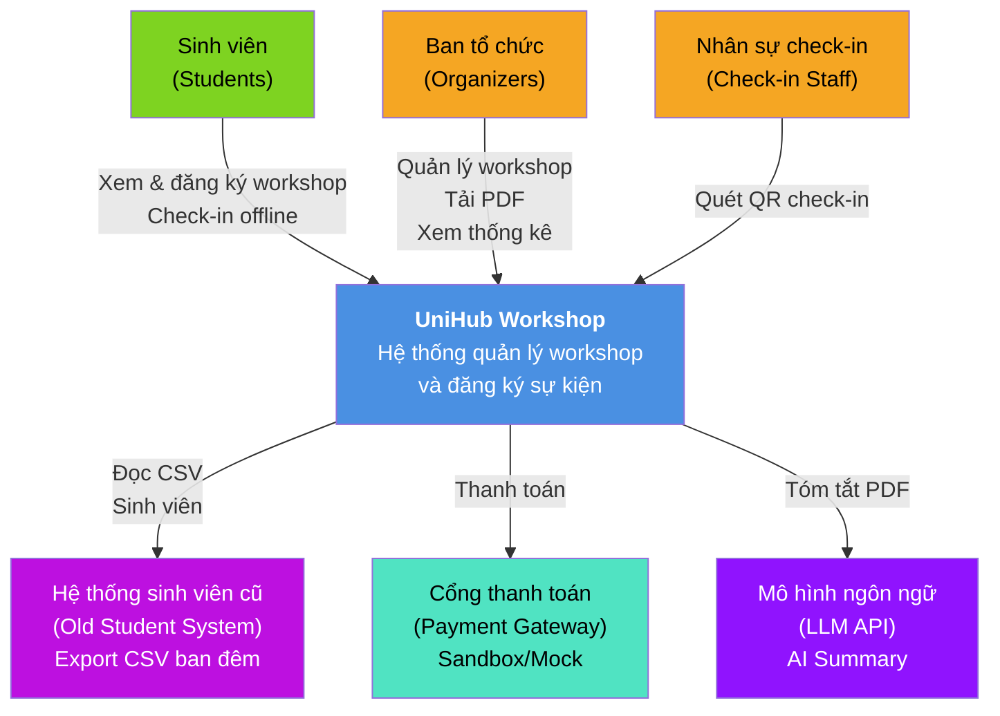
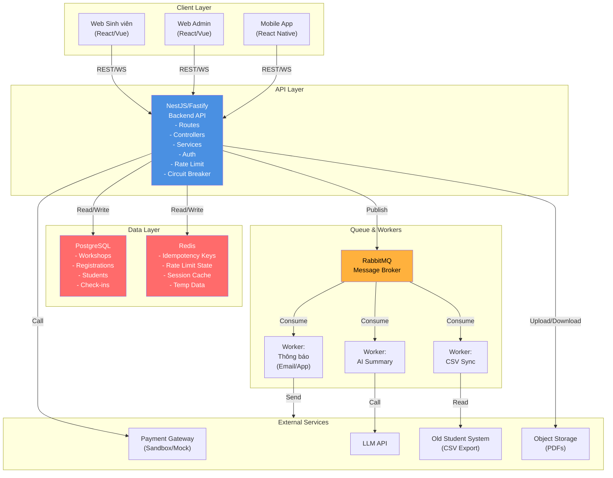
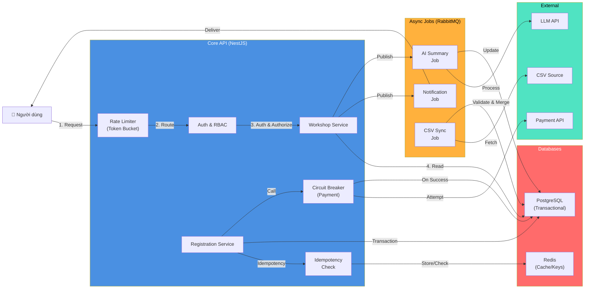
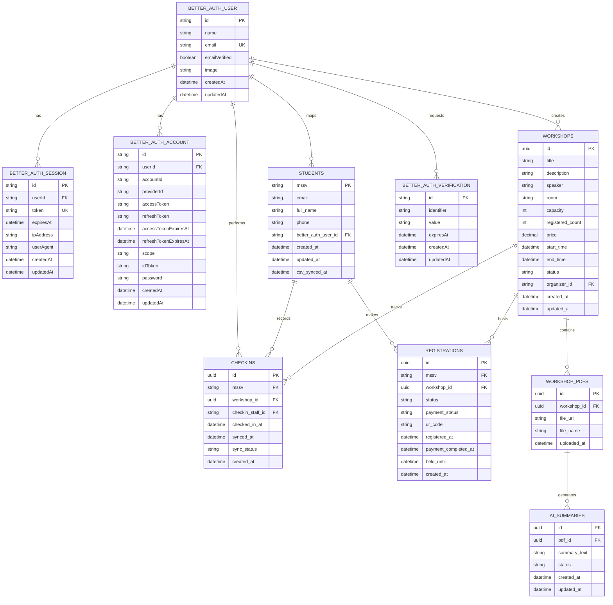

# UniHub Workshop — Technical Design

## Kiến trúc tổng thể

### Architectural Style: Modular Monolith + Worker Pattern

UniHub Workshop được thiết kế theo mô hình **modular monolith kết hợp background workers**, thay vì microservices. Lựa chọn này vì:

- **Đơn giản triển khai**: Một codebase dễ quản lý cho đồ án học tập, tránh độ phức tạp của service-to-service communication, health checks, và distributed transactions.
- **Tính nhất quán dữ liệu mạnh**: Luồng đăng ký quan trọng chạy trong cùng process, kiểm soát transaction chặt chẽ, giảm race condition.
- **Dễ debug**: Stack trace, logging, distributed tracing ít phức tạp hơn microservices.
- **Khả năng mở rộng đủ**: RabbitMQ cho các tác vụ bất đồng bộ, Redis cho cache/rate limiting, cho phép scale workers riêng nếu cần.

### Các thành phần chính

1. **Backend API (NestJS + Fastify)**: Xử lý tất cả endpoint, logic nghiệp vụ, RBAC, rate limiting, circuit breaker.
2. **Transactional Database (PostgreSQL)**: Source of truth cho dữ liệu workshop, đăng ký, sinh viên, check-in.
3. **Cache & Session Store (Redis)**: Lưu idempotency keys, rate limit state, session/JWT validation, dữ liệu tạm thời.
4. **Message Broker (RabbitMQ)**: Hàng đợi bất đồng bộ cho thông báo, AI Summary, CSV sync.
5. **Background Workers (Node.js / NestJS Bull)**: Xử lý từng loại job từ RabbitMQ.
6. **Object Storage**: Lưu PDF tải lên, artifacts được tạo từ AI.
7. **Authentication (BetterAuth)**: Hybrid: session cho admin web, JWT cho mobile/API.
8. **External Integrations**: 
   - Payment Gateway (sandbox/mock)
   - LLM API (AI Summary)
   - Student Management System (CSV batch import)

---

## C4 Diagram

### Level 1 — System Context



### Level 2 — Container



---

## High-Level Architecture Diagram



---

## Thiết kế cơ sở dữ liệu

### Loại Database và Lý do

**PostgreSQL (Primary)**: Lưu toàn bộ dữ liệu transactional:
- Hỗ trợ ACID transaction đầy đủ, cần thiết cho tranh chấp chỗ ngồi và đăng ký.
- Hỗ trợ advisory locks, hữu ích cho race condition giữa các luồng.
- Có trigger, tính năng audit, full-text search nếu cần bổ sung sau.

**Redis (Secondary)**: Cache & state máy tạm thời:
- Lưu idempotency keys (TTL 24h).
- Rate limit state (token bucket data).
- Session/JWT validation cache.
- Dữ liệu tạm thời khi check-in offline (pending syncs).

### Entity Relationship Diagram



### SQL Schema (Các Entity quan trọng)

**Ghi chú**: Bảng BetterAuth (`better_auth_user`, `better_auth_session`, `better_auth_account`, `better_auth_verification`) được sinh từ BetterAuth CLI (`npx auth@latest generate` hoặc `migrate`). Dưới đây là schema cốt lõi và ứng dụng.

```sql
-- BetterAuth Core Tables
-- Được tạo bởi: npx auth@latest migrate
-- Bảng sau đây là core schema BetterAuth dành cho PostgreSQL

-- Better Auth User table
CREATE TABLE better_auth_user (
  id VARCHAR(191) PRIMARY KEY,
  name VARCHAR(191),
  email VARCHAR(191) UNIQUE NOT NULL,
  emailVerified BOOLEAN DEFAULT FALSE,
  image TEXT,
  createdAt TIMESTAMP DEFAULT CURRENT_TIMESTAMP,
  updatedAt TIMESTAMP DEFAULT CURRENT_TIMESTAMP
);

-- Better Auth Session table
CREATE TABLE better_auth_session (
  id VARCHAR(191) PRIMARY KEY,
  userId VARCHAR(191) NOT NULL REFERENCES better_auth_user(id) ON DELETE CASCADE,
  token VARCHAR(191) UNIQUE NOT NULL,
  expiresAt TIMESTAMP NOT NULL,
  ipAddress VARCHAR(191),
  userAgent TEXT,
  createdAt TIMESTAMP DEFAULT CURRENT_TIMESTAMP,
  updatedAt TIMESTAMP DEFAULT CURRENT_TIMESTAMP
);

-- Better Auth Account table
CREATE TABLE better_auth_account (
  id VARCHAR(191) PRIMARY KEY,
  userId VARCHAR(191) NOT NULL REFERENCES better_auth_user(id) ON DELETE CASCADE,
  accountId VARCHAR(191),
  providerId VARCHAR(191) NOT NULL,
  accessToken TEXT,
  refreshToken TEXT,
  accessTokenExpiresAt TIMESTAMP,
  refreshTokenExpiresAt TIMESTAMP,
  scope TEXT,
  idToken TEXT,
  password VARCHAR(255),
  createdAt TIMESTAMP DEFAULT CURRENT_TIMESTAMP,
  updatedAt TIMESTAMP DEFAULT CURRENT_TIMESTAMP
);

-- Better Auth Verification table
CREATE TABLE better_auth_verification (
  id VARCHAR(191) PRIMARY KEY,
  identifier VARCHAR(191) NOT NULL,
  value VARCHAR(191) NOT NULL,
  expiresAt TIMESTAMP NOT NULL,
  createdAt TIMESTAMP DEFAULT CURRENT_TIMESTAMP,
  updatedAt TIMESTAMP DEFAULT CURRENT_TIMESTAMP
);

-- Students table (mapping học sinh)
CREATE TABLE students (
  mssv VARCHAR(20) PRIMARY KEY,
  email VARCHAR(255) UNIQUE,
  full_name VARCHAR(255),
  phone VARCHAR(20),
  better_auth_user_id VARCHAR(191) REFERENCES better_auth_user(id) ON DELETE SET NULL,
  created_at TIMESTAMP DEFAULT CURRENT_TIMESTAMP,
  updated_at TIMESTAMP DEFAULT CURRENT_TIMESTAMP,
  csv_synced_at TIMESTAMP
);

-- Workshops table
CREATE TABLE workshops (
  id UUID PRIMARY KEY DEFAULT gen_random_uuid(),
  title VARCHAR(255) NOT NULL,
  description TEXT,
  speaker VARCHAR(255),
  room VARCHAR(100),
  capacity INT NOT NULL,
  registered_count INT DEFAULT 0,
  price DECIMAL(10, 2) DEFAULT 0,
  start_time TIMESTAMP NOT NULL,
  end_time TIMESTAMP NOT NULL,
  status VARCHAR(50) DEFAULT 'draft',
  organizer_id VARCHAR(191) NOT NULL REFERENCES better_auth_user(id),
  created_at TIMESTAMP DEFAULT CURRENT_TIMESTAMP,
  updated_at TIMESTAMP DEFAULT CURRENT_TIMESTAMP,
  CONSTRAINT valid_time CHECK (end_time > start_time),
  CONSTRAINT valid_capacity CHECK (capacity > 0)
);

-- Registrations table
CREATE TABLE registrations (
  id UUID PRIMARY KEY DEFAULT gen_random_uuid(),
  mssv VARCHAR(20) NOT NULL REFERENCES students(mssv),
  workshop_id UUID NOT NULL REFERENCES workshops(id),
  status VARCHAR(50) DEFAULT 'registered',
  payment_status VARCHAR(50) DEFAULT 'pending',
  qr_code VARCHAR(255) UNIQUE NOT NULL,
  registered_at TIMESTAMP DEFAULT CURRENT_TIMESTAMP,
  payment_completed_at TIMESTAMP,
  held_until TIMESTAMP,
  created_at TIMESTAMP DEFAULT CURRENT_TIMESTAMP,
  UNIQUE(mssv, workshop_id)
);

CREATE INDEX idx_registrations_mssv ON registrations(mssv);
CREATE INDEX idx_registrations_workshop_id ON registrations(workshop_id);
CREATE INDEX idx_registrations_status ON registrations(status);

-- Check-ins table
CREATE TABLE checkins (
  id UUID PRIMARY KEY DEFAULT gen_random_uuid(),
  mssv VARCHAR(20) NOT NULL REFERENCES students(mssv),
  workshop_id UUID NOT NULL REFERENCES workshops(id),
  checkin_staff_id VARCHAR(191) NOT NULL REFERENCES better_auth_user(id),
  checked_in_at TIMESTAMP NOT NULL,
  synced_at TIMESTAMP,
  sync_status VARCHAR(50) DEFAULT 'pending',
  created_at TIMESTAMP DEFAULT CURRENT_TIMESTAMP
);

CREATE INDEX idx_checkins_mssv ON checkins(mssv);
CREATE INDEX idx_checkins_workshop_id ON checkins(workshop_id);

-- Workshop PDFs
CREATE TABLE workshop_pdfs (
  id UUID PRIMARY KEY DEFAULT gen_random_uuid(),
  workshop_id UUID NOT NULL REFERENCES workshops(id),
  file_url VARCHAR(2048) NOT NULL,
  file_name VARCHAR(255),
  uploaded_at TIMESTAMP DEFAULT CURRENT_TIMESTAMP
);

-- AI Summaries
CREATE TABLE ai_summaries (
  id UUID PRIMARY KEY DEFAULT gen_random_uuid(),
  pdf_id UUID NOT NULL REFERENCES workshop_pdfs(id),
  summary_text TEXT,
  status VARCHAR(50) DEFAULT 'processing',
  created_at TIMESTAMP DEFAULT CURRENT_TIMESTAMP,
  updated_at TIMESTAMP DEFAULT CURRENT_TIMESTAMP
);

-- CSV Sync Log
CREATE TABLE csv_sync_logs (
  id UUID PRIMARY KEY DEFAULT gen_random_uuid(),
  sync_time TIMESTAMP DEFAULT CURRENT_TIMESTAMP,
  total_records INT,
  successful_records INT,
  failed_records INT,
  conflict_records INT,
  status VARCHAR(50),
  error_message TEXT
);
```

### Bảng mô tả Entity chính

| Entity | Mục đích | Constraint quan trọng |
|--------|---------|------------------------|
| **Students** | Lưu thông tin sinh viên (từ CSV sync) | MSSV unique, email unique; xác thực từ CSV |
| **Workshops** | Lưu thông tin workshop | Capacity > 0, end_time > start_time, organizer_id tồn tại |
| **Registrations** | Lưu đăng ký workshop | Unique(mssv, workshop_id), held_until 10 phút nếu có phí |
| **Checkins** | Lưu check-in hiện diện | sync_status cho offline sync, mssv + workshop_id xác định |
| **Users** | Tài khoản admin/organizer/staff | email unique, role từ enum |
| **Workshop_PDFs** | Lưu PDF tải lên | 1-1 với AI_Summaries |
| **AI_Summaries** | Lưu kết quả tóm tắt | status tracking (processing/completed/failed) |
| **CSV_Sync_Logs** | Kiểm tra lịch sử nhập CSV | Báo cáo từng lô nhập |

---

## Thiết kế kiểm soát truy cập

### Mô hình RBAC (Role-Based Access Control)

Hệ thống có **3 roles chính**:

#### 1. **Student (Sinh viên)**
- Quyền:
  - Xem danh sách workshop (public, paginated)
  - Xem chi tiết workshop (bao gồm mô tả, AI Summary nếu có)
  - Đăng ký workshop (miễn phí hoặc thanh toán)
  - Xem lịch sử đăng ký của mình
  - Xem mã QR của đăng ký
- Endpoint API:
  - `GET /workshops` - danh sách
  - `GET /workshops/{id}` - chi tiết
  - `POST /registrations` - đăng ký
  - `GET /registrations/me` - lịch sử của tôi
  - `GET /registrations/{id}/qr` - QR code
- Authentication: JWT hoặc session

#### 2. **Organizer (Ban tổ chức)**
- Quyền:
  - Tạo workshop mới
  - Sửa workshop (title, description, speaker, room, time, capacity, price)
  - Hủy workshop
  - Xem danh sách sinh viên đã đăng ký
  - Xem thống kê (tổng đăng ký, số check-in, doanh thu)
  - Tải lên PDF workshop
  - Xem AI Summary của workshop
- Endpoint API:
  - `POST /admin/workshops` - tạo
  - `PATCH /admin/workshops/{id}` - sửa
  - `DELETE /admin/workshops/{id}` - hủy
  - `GET /admin/workshops/{id}/registrations` - danh sách đăng ký
  - `GET /admin/statistics` - thống kê
  - `POST /admin/workshops/{id}/pdf` - tải PDF
  - `GET /admin/workshops/{id}/summary` - xem AI summary
- Authentication: Session (admin web) hoặc JWT (API)

#### 3. **CheckinStaff (Nhân sự check-in)**
- Quyền:
  - Quét QR code sinh viên
  - Xác nhận check-in
  - Xem danh sách check-in của workshop (chỉ workshop tương ứng)
  - Check-in offline (local storage, sync khi có mạng)
- Endpoint API:
  - `POST /checkins/scan` - quét QR
  - `POST /checkins/confirm` - xác nhận check-in
  - `GET /checkins/workshop/{id}` - danh sách check-in
  - `POST /checkins/sync` - đồng bộ offline
- Authentication: JWT hoặc session (mobile app)

### Cơ chế kiểm tra quyền

**Middleware Authorization**:
1. Middleware kiểm tra JWT/Session → extract role
2. Middleware kiểm tra endpoint yêu cầu quyền nào
3. So sánh role user với required role
4. Nếu hợp lệ → `next()`, nếu không → 403 Forbidden

---

## Thiết kế các cơ chế bảo vệ hệ thống

### Kiểm soát tải đột biến

**Vấn đề**: 12.000 sinh viên trong 10 phút đầu, 60% trong 3 phút đầu → request rate có thể vượt quá khả năng xử lý.

**Giải pháp: Token Bucket Algorithm**

**Cấu hình cho UniHub Workshop**:

| Endpoint | Ngưỡng | Refill | Thời gian cửa sổ |
|----------|--------|--------|------------------|
| `GET /workshops` (public) | 100 requests/phút | 100/60s | Per user IP |
| `POST /registrations` | 10 requests/phút | 10/60s | Per user (authenticated) |
| `GET /admin/*` | 50 requests/phút | 50/60s | Per user (admin) |
| `POST /checkins` (offline) | 1000 requests/phút (local) | Unlimited khi offline | Local device |

**Fallback khi rate limit vượt quá**:
- Sinh viên nhận thông báo "Hệ thống quá tải, vui lòng thử lại sau 60 giây".
- API trả về 429 status code với header `Retry-After: 60`.

### Xử lý cổng thanh toán không ổn định

**Vấn đề**: Payment gateway có thể timeout hoặc lỗi → dẫn tới cascading failure.

**Giải pháp: Circuit Breaker + Graceful Degradation**

**Circuit Breaker có 3 trạng thái**:

1. **Closed** (bình thường): Gọi payment gateway bình thường.
2. **Open** (ngắt): Sau N lỗi liên tiếp (N=5) → chuyển sang Open, không gọi gateway.
3. **Half-Open** (thử kết nối): Sau 60 giây → thử 1 request test.

**Cấu hình**:
```
Failure Threshold: 5 lỗi liên tiếp hoặc 50% error rate
Timeout: 5 giây per request
Open Duration: 60 giây
```

**Graceful Degradation**:
- **Workshop miễn phí**: vẫn cho đăng ký bình thường.
- **Workshop có phí**: báo lỗi nhưng xem danh sách workshop vẫn hoạt động.

### Chống trừ tiền hai lần

**Vấn đề**: Client retry payment request → thanh toán 2 lần.

**Giải pháp: Idempotency Key + Deduplication**

**Cấu hình**:

| Tham số | Giá trị | Ghi chú |
|---------|--------|--------|
| TTL Idempotency Key | 24 giờ | Đủ cho retry window |
| Storage | Redis | Nhanh, in-memory |
| Key Format | `idempotency:{key}` | Dễ query debug |
| Collision Detection | UUID v4 | Xác suất collision ≈ 0 |

**Luồng xử lý**:
```
1. Client gửi Idempotency-Key header
2. Server kiểm tra Redis:
   - Nếu tìm thấy (đã xử lý) → trả response cũ
   - Nếu không (lần đầu) → xử lý + lưu kết quả
3. TTL 24h → tự expire
```

#### Bổ sung cho luồng thanh toán có phí: Hold Seat 10 phút

**Ràng buộc**: Nếu đăng ký có phí chưa thanh toán → giữ chỗ trong 10 phút.  
Sau 10 phút nếu chưa thanh toán → chỗ trở thành available.

**Triển khai**:
- Khi đăng ký có phí → set `registration.held_until = NOW + 10 minutes`.
- Database query: chỉ count `registered_count` những registration hoàn tất thanh toán hoặc đang giữ chỗ (held_until > NOW).
- Background job mỗi 5 phút: tìm registration hết hạn giữ chỗ → cập nhật thành cancelled.

---

## Các quyết định kỹ thuật quan trọng (ADR)

### ADR-1: Backend Framework — NestJS + Fastify

**Lựa chọn**: NestJS (TypeScript) chạy trên Fastify engine.

**Các phương án khác**:
1. **Express + Node.js thuần**: Đơn giản, nhưng thiếu cấu trúc → khó bảo trì, không có kiểu dữ liệu.
2. **Spring Boot (Java)**: Mạnh và trưởng thành, nhưng nặng, khởi động chậm.

**Đánh đổi của từng phương án**:
- Express: Dễ học, linh hoạt | nhưng thiếu cấu trúc, không có kiểu dữ liệu
- Spring Boot: Mature, doanh nghiệp | nhưng nặng, khởi động chậm, học tập khó
- **NestJS + Fastify**: Cấu trúc rõ ràng, kiểu dữ liệu, HTTP nhanh | nhưng thiết lập phức tạp hơn Express

**Tại sao chọn NestJS + Fastify**: Cân bằng giữa trải nghiệm lập trình viên (cấu trúc + kiểu dữ liệu) và hiệu suất (Fastify nhanh, xử lý tải cao).

---

### ADR-2: Database — PostgreSQL + Redis

**Lựa chọn**: PostgreSQL làm primary, Redis cho cache/session/rate limiting.

**Các phương án khác**:
1. **MySQL + Redis**: Tương tự PostgreSQL, hỗ trợ ACID, nhưng PostgreSQL mạnh hơn về tính năng nâng cao.
2. **MongoDB + Redis**: NoSQL, mở rộng ngang dễ, nhưng mất giao dịch ACID → rủi ro dữ liệu không nhất quán.
3. **DynamoDB/Firebase**: Serverless, tự động mở rộng, nhưng bị khóa nhà cung cấp, chi phí cao, không phù hợp cho 12k người dùng.
4. **PostgreSQL đơn thuần (không Redis)**: Đơn giản, nhưng chậm hơn, không tối ưu cho cache/session.

**Đánh đổi của từng phương án**:
- MySQL: Tương tự PG | ghi phân tán khó hơn PG
- MongoDB: Mở rộng tự động | mất giao dịch, điều kiện chạy khó lớn
- DynamoDB: Serverless | bị khóa, chi phí, độ phức tạp
- PG đơn thuần: Đơn giản | chậm, không tối ưu
- **PG + Redis**: Nhất quán ACID, cache nhanh, giới hạn tốc độ | hơi phức tạp hơn

**Tại sao chọn PG + Redis**: ACID đảm bảo không bán quá chỗ, Redis giải quyết hiệu suất và giới hạn tốc độ.

---

### ADR-3: Message Broker — RabbitMQ

**Lựa chọn**: RabbitMQ cho hàng đợi bất đồng bộ (thông báo, tóm tắt AI, đồng bộ CSV).

**Các phương án khác**:
1. **Kafka**: Dựa trên log, thông lượng cao, nhưng thiết lập phức tạp & bảo trì, quá mức cho workshop.
2. **AWS SQS**: Quản lý hoàn toàn, nhưng bị khóa nhà cung cấp, độ trễ cao.
3. **Redis Queue (Bull/BullMQ)**: Đơn giản, trong bộ nhớ, nhưng rủi ro mất dữ liệu nếu Redis sập.
4. **BullMQ + PostgreSQL**: Bền, đơn giản, nhưng thông lượng thấp hơn.

**Đánh đổi của từng phương án**:
- Kafka: Thông lượng cao | phức tạp, overhead
- SQS: Quản lý | bị khóa, độ trễ, chi phí
- Redis Queue: Đơn giản | rủi ro mất dữ liệu, thông lượng
- BullMQ: Bền, đơn giản | thông lượng
- **RabbitMQ**: Đơn giản, đáng tin cậy, linh hoạt, phù hợp quy mô workshop | cần một ít quản lý

**Tại sao chọn RabbitMQ**: Tránh quá phức tạp (Kafka), bền (vs Redis Queue), giá rẻ (vs SQS).

---

### ADR-4: Authentication — BetterAuth (Hybrid)

**Lựa chọn**: BetterAuth với chiến lược hybrid (cookie session cho web admin, JWT cho mobile/API).

**Các phương án khác**:
1. **Auth0**: Quản lý hoàn toàn, nhưng đắt, bị khóa nhà cung cấp.
2. **Clerk**: Hiện đại, thân thiện lập trình viên, nhưng $$$, bị khóa.
3. **NextAuth.js**: Tốt cho Next.js, nhưng linh hoạt hạn chế.
4. **Chỉ JWT không trạng thái**: Đơn giản, nhưng vô hiệu hóa session khó.
5. **Chỉ session có trạng thái**: Bảo vệ XSS dễ, nhưng không phù hợp mobile/API.

**Đánh đổi của từng phương án**:
- Auth0/Clerk: Quản lý | đắt, bị khóa
- NextAuth.js: Tốt cho Next.js | cứng nhắc
- Chỉ JWT: Đơn giản | vô hiệu hóa khó
- Chỉ session: Bảo vệ XSS | không phù hợp API
- **BetterAuth Hybrid**: Tốt nhất (session + JWT), tự lưu trữ, linh hoạt | duy trì 2 quy trình

**Tại sao chọn BetterAuth**: Hybrid cho phép admin (session, bảo vệ XSS) + mobile/API (không trạng thái, mở rộng), tự lưu trữ (không bị khóa), mã mở.

---

### ADR-5: Rate Limiting — Token Bucket

**Lựa chọn**: Thuật toán Token Bucket trên Redis.

**Các phương án khác**:
1. **Cửa sổ cố định**: Bộ đếm request/phút, đơn giản, nhưng loạt yêu cầu ở ranh giới.
2. **Cửa sổ trượt**: Bộ đếm giây, công bằng, nhưng overhead bộ nhớ.
3. **Leaky Bucket Algorithm**: Tốc độ mượt, nhưng phức tạp, quá mức.
4. **Không giới hạn**: Đơn giản, nhưng 12k request/10 phút sẽ làm sập server.

**Đánh đổi của từng phương án**:
- Cửa sổ cố định: Đơn giản | loạt ở ranh giới (tất cả request ở :59-:00)
- Cửa sổ trượt: Công bằng, mượt | nặng bộ nhớ
- Leaky Bucket: Mượt | phức tạp, quá mức
- Không giới hạn: Đơn giản | sập server
- **Token Bucket**: Hạn ngạch công bằng + cho phép loạt, hỗ trợ Redis | hơi phức tạp

**Tại sao chọn Token Bucket**: Công bằng (hạn ngạch/người dùng) + xử lý loạt (chịu đựng loạt), Redis làm nhanh & phân tán.

---

### ADR-6: Payment Integration — Sandbox/Mock Gateway

**Lựa chọn**: Mock payment gateway với mô hình adapter.

**Các phương án khác**:
1. **Cổng thanh toán thực (Stripe/VNPay)**: Sản xuất-sẵn, nhưng có chi phí, thiết lập phức tạp.
2. **Không thanh toán**: Chỉ workshop miễn phí, nhưng giới hạn tính năng.
3. **Logic thanh toán tùy chỉnh**: Toàn quyền điều khiển, nhưng không an toàn, rủi ro tuân thủ.

**Đánh đổi của từng phương án**:
- Cổng thực: Sản xuất | chi phí, độ phức tạp
- Không thanh toán: Đơn giản | giới hạn
- Logic tùy chỉnh: Điều khiển | không an toàn, trách nhiệm
- **Mock (adapter)**: An toàn phát triển/demo, dễ kiểm tra, thay sau | không sản xuất

**Tại sao chọn Mock**: Mô hình adapter dễ dàng thay thế thành Stripe/VNPay sau khi triển khai thực.

---

### ADR-7: AI Summary — External LLM API

**Lựa chọn**: Gọi LLM API bên ngoài (OpenAI, Anthropic, hoặc LLM địa phương).

**Các phương án khác**:
1. **LLM tự host (Ollama, LLaMA)**: Toàn quyền điều khiển, không chi phí API, nhưng cần GPU, bảo trì, chất lượng không được đảm bảo.
2. **Mô hình LLM nhỏ cục bộ**: Nhanh, miễn phí, nhưng chất lượng hạn chế, vấn đề giấy phép.
3. **Tóm tắt dựa trên quy tắc đơn giản**: Nhanh, rẻ, nhưng chất lượng thấp.

**Đánh đổi của từng phương án**:
- Tự lưu trữ: Điều khiển, không chi phí | GPU, bảo trì, rủi ro chất lượng
- LLM nhỏ cục bộ: Nhanh | chất lượng, giấy phép
- Dựa trên quy tắc: Nhanh, rẻ | chất lượng thấp
- **API bên ngoài**: Chất lượng được đảm bảo, không bảo trì | chi phí, phụ thuộc

**Tại sao chọn API LLM bên ngoài**: Chất lượng được đảm bảo (OpenAI/Anthropic), không bảo trì GPU, bất đồng bộ không chặn luồng, chi phí hợp lý cho workshop.

---

### ADR-8: CSV Sync — Nightly Batch + Last-Write-Wins

**Lựa chọn**: Chạy theo lô vào ban đêm tại thời điểm 01:00 & 04:00. Nếu có xung đột dữ liệu, giải quyết bằng cách ghi đè (lấy bản mới nhất từ CSV).

**Các phương án khác**:
1. **Đồng bộ thời gian thực**: Nhất quán cao, nhưng phức tạp, vấn đề thông lượng khi xung đột.
2. **Nhập thủ công**: Được kích hoạt bởi người dùng, nhưng lỗi người dùng, dữ liệu trễ.
3. **Giải quyết xung đột hợp nhất**: Công bằng, nhưng phức tạp, chậm.
4. **Ghi đầu tiên thắng**: Bảo tồn gốc, nhưng dữ liệu cũ.

**Đánh đổi của từng phương án**:
- Thời gian thực: Nhất quán | phức tạp, xung đột khó
- Thủ công: Đơn giản | lỗi người dùng, trễ
- Hợp nhất xung đột: Công bằng | phức tạp, chậm
- Ghi đầu tiên: Đơn giản | dữ liệu cũ
- **Lô đêm + Ghi cuối cùng**: Lô đơn giản, lịch dự đoán được, dự phòng (2x), xung đột đơn giản | trễ nhẹ (ok cho dữ liệu sinh viên)

**Tại sao chọn Lô đêm + Ghi cuối cùng**: Dữ liệu sinh viên không quan trọng thời gian thực, xử lý lô (xác thực, nhật ký kiểm toán), lịch 2x (độ tin cậy), ghi cuối cùng đơn giản & dự đoán được.

---

## Kết luận

UniHub Workshop được thiết kế để xử lý tải cao, đảm bảo data consistency, graceful degradation khi payment lỗi, và offline-first mobile check-in. Các cơ chế bảo vệ được cài đặt thực tế, không chỉ mô phỏng.